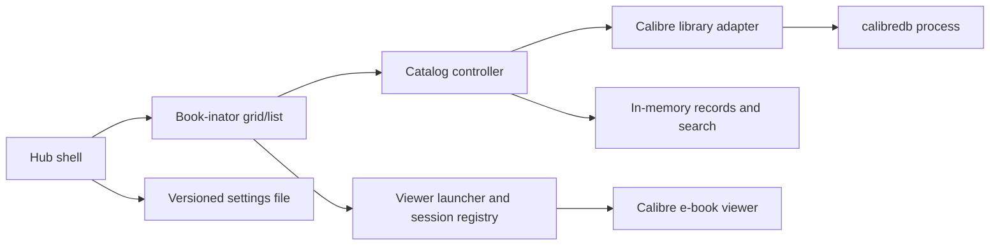

# M1 Technical Design — Hub and Book-inator

Status: M1 complete. G1 and G2 passed for the accepted Calibre 9.2.1 workflow; final M1 user acceptance is recorded. Historical checkpoints below retain their context. M2 implementation is described in technical_design_m2.md.

## 1. Scope and evidence

Implement [M1](milestone_01_browse_and_read.md): one profile, one remembered Calibre library, tabbed Book-inator, grid/list browsing, title/author search, Unknown for unavailable reading status, and explicit format-button viewer launch. Editing, file intake, automatic Calibre refresh, progress updates, and named states remain later passes.

Verified local environment:

- Ubuntu 26.04.1 LTS; KDE 6 environment variables; Wayland session.
- Python 3.14.4.
- PyQt6 6.10.2 and Qt 6.10.2; Qt Widgets foundation built and tested offscreen; desktop review remains separate.
- Calibre 9.2.1. JSON listing and title/author queries passed on a copied one-book library. EPUB viewer launch and readable rendering were confirmed by the user.
- Library path: `/home/sproket01/Calibre Library`. The library now contains the original guide plus 100 imported test titles, including MOBI/PDF and multi-format samples; see [collection manifest](test_data/free_ebooks_100/README.md). Representative EPUB/MOBI/PDF readability and page navigation are user-confirmed; application UI scale acceptance remains pending.

Full evidence and limits: [Calibre capability report](calibre_capability_validation.md). Command availability is not proof of multi-format rendering, safe concurrent library access, or graceful viewer-session closure.

## 2. Technical decisions

| ID | Decision | Reason and qualification |
| --- | --- | --- |
| TD01 | Python with PyQt6 / Qt Widgets | Already installed; provides a desktop model/view approach and a path to later docking. M1 does not require QML or an embedded browser |
| TD02 | One application process with a hub and module components | Fits one device and one initial module; separate module windows later need not mean separate processes |
| TD03 | List a private library snapshot through the installed Calibre CLI; open original files | User-approved M1 policy; preserves source catalog and avoids internal Calibre APIs |
| TD04 | Versioned JSON for M1 application settings; catalog records held in memory | M1 owns preferences and session selection, not a second authoritative catalog. A persistent catalog cache/database is not needed for the current test scale |
| TD05 | One card/list row per existing Calibre record; format buttons from that record | Preserves existing library grouping. Matching titles across records is not sufficient to merge them |
| TD06 | Local title/author filtering after successful JSON load | Avoids spawning Calibre for each keystroke and keeps both views consistent. Verified CLI queries remain an integration diagnostic |
| TD07 | One hub-launched reader at a time in M1, using a separate viewer instance | User-approved initial restriction; component close tested, application reader integration still pending |
| TD08 | Restore catalog/UI session only in M1 | Progress and automatic viewer-position restoration were deferred; format selection explicitly opens a reader |

PySide6 is a reasonable alternative but was not found among the checked installed packages; do not add a second Qt binding to this design. PyQt's distribution licensing is documented by its publisher; selecting it for this personal milestone does not choose the project's eventual publication licence. Revisit packaging/licence requirements before wider distribution. [PyQt publisher](https://www.riverbankcomputing.com/software/pyqt).

Qt's model/view design supports multiple presentations of common data. Qt provides subprocess handling through QProcess and dockable widgets for later workspace work. These capabilities support the selection; the actual application still needs target-desktop checks. [Model/view](https://doc.qt.io/qt-6/model-view-programming.html), [QProcess](https://doc.qt.io/qt-6/qprocess.html), [Dock widgets](https://doc.qt.io/qtforpython-6/PySide6/QtWidgets/QDockWidget.html).

## 3. Components and ownership

| Component | Responsibility | Does not own |
| --- | --- | --- |
| Hub shell | Main window, Book-inator tab, startup and close coordination | Calibre metadata |
| Book-inator view | Grid/list switch, format actions, visible status, selection | Library storage or process control |
| Catalog controller | Load state, selection, search, refresh requests, error presentation | Calibre schema |
| Library adapter | Produce normalized records from validated Calibre command output | Profile preferences or viewer windows |
| Settings store | Personal profile/device identity, library binding, view mode and last-session selection | Book metadata or Calibre preferences |
| Viewer launcher/session registry | Start requests, originating profile/module, launch ownership, observed lifecycle | Guaranteed page tracking or global control of Calibre |
| Operation runner | Asynchronous command execution, output/error collection, cancellation | Decisions to kill unrelated processes |

Only the settings store writes Media-inator settings in M1. The adapter must not add/edit/import books. The external viewer may maintain its own settings and annotations; do not equate read-only catalog browsing with a side-effect-free external reader.

## 4. Data contract, without a database schema

| Concept | Minimum information |
| --- | --- |
| Profile | Persistent application-generated identity and display name; one active profile in M1 |
| Device | Persistent local identity; distinguish device layout from profile-level information |
| Library binding | Application binding identity, selected root, observed Calibre version, last successful load |
| Book record | Binding identity plus Calibre numeric ID, observed UUID, title, author display text, tags, cover location, format references, reading-status value/source |
| Format reference | Parent record, format label, returned path, current availability |
| UI session | Open module selection, grid/list mode, selected record, window geometry |
| Viewer session | Originating profile/module/book/file, launched-versus-attached-or-unknown ownership, start result, observed liveness, available close capability |

Numeric book IDs are scoped to their library binding. Preserve UUID as returned, but do not assume cross-library/import identity guarantees that have not been tested. Paths are locators, not book identity. Different formats remain different files attached to one existing Calibre record. Distinct records remain distinct until later identity rules exist.

The installed JSON output returns authors as display text and tags/formats as arrays. Preserve author text; do not split it on guessed delimiters. Normalize missing fields without inventing values. Use Unknown when no verified reading-status source is mapped; ratings, tags, and empty progress are not automatically reading-status signals.

Do not persist reading progress in M1. Later personal progress must be keyed by profile and book identity with per-file positions; it must not be inferred from the currently selected UI profile for an older viewer session.

## 5. Library access: measured behaviour and remaining boundary

Pass 2 found no persistent file or logical database changes from two listings and two searches on the copied current library. The viewer subsequently added an annotation-related database record. A simulated occupied database lock correctly rejected listing. These findings narrow the earlier uncertainty without guaranteeing other schemas or concurrent GUI use. See the capability report for evidence.

Installed source inspection provides an important qualification to the successful read tests:

- `/usr/lib/calibre/calibre/db/cli/main.py` acquires Calibre's database single-instance lock and opens `LibraryDatabase(self.library_path)` for local commands. It can reject direct access while another Calibre database-owning program is running.
- `/usr/lib/calibre/calibre/db/cli/cmd_list.py` marks listing logically read-only, but format and cover paths are resolved using the database's file lookup routines.
- `/usr/lib/calibre/calibre/db/backend.py` opens with `read_only=False` by default, performs schema/trigger maintenance, and has internal copy-based handling for its read-only option. This explains why writes are plausible; it does not prove exactly which operation changed the earlier test database.

**Accepted M1 strategy:** browse a temporary private copy, open original book files, and require Calibre/other readers to be closed while refreshing or launching. One hub-launched reader at a time remains the agreed M1 limit. See the [accepted access decision](m1_library_access_decision.md).

The adapter uses SQLite backup from a read-only source connection and copies supporting files so Calibre can resolve formats/covers. Run listing only against the copy and remap returned paths to the selected original library. Reject detected source changes and symlinks; report errors and preserve previous results as stale. Snapshot cleanup, cancellation and disk/time costs are part of the implementation. A snapshot is not a user backup.

A Content server is not selected for M1. No direct Calibre catalog-schema reader/writer or undocumented internal API is selected. The SQLite backup call copies the database; it does not interpret Calibre's catalog tables. The one-book snapshot integration check passed; normal entry-point integration and actual conflict/recovery verification remain before G1 closes.

Process detection is best-effort, not a cross-application mutex. The reader may update original-library annotations. This accepted workflow limits exposure but does not fix or certify simultaneous writes. External readers remain externally owned and are never force-closed.

## 6. Loading, search, and presentation

Load states: no library selected, loading, ready, ready with item-level warnings, unavailable, and failed. A failed load is not an empty library.

At startup, validate the remembered folder and database presence, then request a load asynchronously. Use the verified JSON listing fields: title, authors, tags, formats, cover, and UUID; retain the returned numeric ID. Keep standard error separate from JSON. On success, validate the response shape and replace the in-memory catalog as one coherent result. On failure, preserve any previous successful view with an explicit stale/error indicator.

Grid and list share one catalog model and one search result set. Both expose title, author, format choices, tags, and reading status. Remember the view choice immediately. Use a placeholder for absent covers and bounded thumbnail loading so rendering does not wait for every image.

For M1, text search uses case-insensitive title-or-author substring matching; empty text restores the whole loaded catalog. Quotes and punctuation are literal search input, not a Calibre query language or shell command. Stable ordering uses title then record ID. Advanced matching/filtering remains later work. This is a working interaction default consistent with the confirmed title/author search, not a claim that Calibre CLI search has identical semantics.

M1 loads on startup/library selection; a retry action can reload after an error. Automatic external metadata refresh belongs to M2. An unavailable library offers locating the library or retrying. Missing individual files do not remove their other available formats or other books. Defer persistent exclusion/location-maintenance controls until their semantics are implemented rather than display nonfunctional controls.

## 7. Command execution and reader sessions

Use resolved executable paths and argument arrays, never shell interpolation of file paths or search text. Run metadata commands asynchronously with captured output, bounded execution, and errors visible in the UI. Do not block the GUI while a command completes. QProcess supports separate arguments and process signals; these do not by themselves guarantee viewer readiness. [QProcess](https://doc.qt.io/qt-6/qprocess.html).

The verified launch form is `ebook-viewer --new-instance` followed by the selected absolute file path. Recheck the file before launching. M1 opens normally; it does not send `--continue` or invent an `--open-at` value. Preserve the existing viewer preferences in actual use; the temporary configuration used for tests is not automatically the production setting.

Represent launch outcomes honestly: requested, process started, failed, exited, or ownership/liveness unknown. Process creation is not confirmation that a book rendered. Store originating ownership before issuing the launch request.

**Keep open must survive hub exit.** Pass 2 verified that a viewer launched through `QProcess.startDetached` survives the temporary Qt launcher exiting. Select detached launch for M1, with separate session tracking; it does not provide normal child-process completion signals. Capture process identity beyond a bare PID and avoid acting on a reused PID. The actual hub review/settings flow still needs implementation acceptance.

Installed viewer help provides no close-session command. For installed Calibre 9.2.1 on this Linux machine, source inspection and a targeted test verified that SIGTERM follows the viewer's normal save/close path: exit was observed, settings/annotation files updated, and stderr was empty. Treat this as a version-specific adapter capability, not a general external-application API. Only request it after the combined review selects Close and ownership rules permit closure; verify launched-session identity and use a stable process handle (Linux pidfd), not process-name matching or a bare stored PID. A pidfd cannot repair mistaken identity when first acquired: capture and verify it while establishing launch ownership. Attached applications and unrelated sessions remain untouched.

Use a bounded asynchronous wait. On unsupported versions, uncertain identity, or failure to close, explain and offer Retry / Leave open and continue / Cancel, including manual closure. Do not escalate to force-killing. Detached-process exit observation does not supply a normal child exit code or prove every saved annotation is correct.

The user needed a keypress before the test book became readable. The user accepted deferral to TODO-VIEWER-01 in the implementation plan; this issue does not block M1 or initial integration. Investigate initial focus/rendering in a later usability pass; process start is not viewer readiness. G2 establishes component feasibility, not acceptance of the eventual hub's review dialog and shutdown behaviour.

## 8. Settings persistence and failures

Keep one versioned settings document in the platform application-config location, outside the Calibre library. Store profile/device identity, the library binding, UI preferences, window geometry, and pre-exit module selection. Resolve the location through Qt's standard-path facilities during implementation; do not hardcode this user's home directory.

Use atomic replacement on each committed settings change, retaining the previous valid document on failure. Qt's QSaveFile provides temporary-write/commit semantics. Do not enable a fallback that silently loses the atomicity guarantee. [QSaveFile](https://doc.qt.io/qt-6/qsavefile.html).

Show save failures instead of claiming settings were saved. Do not silently overwrite malformed or newer-version settings. Define a minimal settings-version migration and recovery path in the scaffold. Stable profile/device IDs leave room for future scope without selecting a synchronisation scheme.

Catalog edits and their emergency recovery are not implemented in M1. Library metadata remains in Calibre; the JSON document is not its backup. Diagnostic output should include operation/version/error context rather than indiscriminately recording complete catalog contents.

## 9. Validation gates and next implementation order

| Gate | Required evidence | Blocks |
| --- | --- | --- |
| G1 | PASSED for accepted M1 policy: private-copy query/original-path mapping, unchanged source, actual process detection/refusal/retry and missing-library errors verified; normal entry point enabled | Final/live library adapter |
| G2 | PASSED/CLOSED for Calibre 9.2.1: detached survival, handled close, user-confirmed EPUB/MOBI/PDF reading and actual hub Cancel/Close reader outcomes; current regressions pass. Keypress issue remains accepted non-blocking backlog | No remaining M1 viewer-lifecycle blocker |
| G3 | Foundation checks PASSED: 19 automated tests and one-book adapter smoke checks; final workflow checks separate | Stack/scaffold verification |
| G4 | Sample/CLI checks PASSED: all three formats, 101 records, 15 multi-format groups. Actual app format/scale and negative-case checks remain | Full M1 format/scale acceptance, not all design work |

Current next work is final M2 desktop sign-off, tracked in [M2 acceptance](test_data/m2_acceptance/README.md). M1-01–M1-07 are complete; this does not close all broader P2 architecture/packaging tasks. The G3/G4 descriptions above preserve their earlier component checkpoints; final M1 application acceptance and current regressions supersede their pending-work statements.

## 10. Source and decision maintenance

Official documentation may describe newer versions than those installed. Use installed help/source and observed results for version-specific decisions. Local source was inspected for validation, not copied into application code. Recheck integration assumptions when Calibre or Qt changes.

Update this design, the [implementation plan](implementation_plan_hub_bookinator.md), and affected requirements together when a working decision changes. Preserve the full suite's later commitments; this design narrows implementation to M1 rather than rewriting the constitutions as technology specifications.

Expanded dataset follow-up: the fresh 101-record copy passed metadata, cover-file, format-path, manifest hash, CLI search, and grouping checks. Three concurrent viewer launches exposed annotation-write lock errors in EPUB/PDF sessions; define and validate concurrency/error handling before claiming successful simultaneous viewer persistence. The user confirmed all three samples are readable and allow page changes; this does not establish successful annotation saving. See the capability report; G1 remains open.

Annotation comparison completed: sequential EPUB, MOBI, and PDF bookmarks matched local and copied-library storage before and after handled closure, with empty stderr for each. All test viewers closed and source-library hashes remained unchanged. With three viewers open, later staggered bookmarks also persisted without additional errors, but initial concurrent-launch BusyErrors (EPUB/PDF) remain unresolved. This supports sequential sample feasibility, not simultaneous-write safety or automatic recovery. See the [final comparison](test_data/free_ebooks_100/annotation_validation/README.md#final-comparison). G1 concurrency/failure handling and application acceptance remain open; no application code was written.

Foundation implementation: versioned schema-1 settings, one profile/device, sample grid/list/search, selected-book and module restoration are implemented. Preference actions save immediately; geometry events debounce for 250 ms and flush at exit. Reader launching/live access remain unavailable. The user requires G1 completion before the full 101-book application acceptance; sample foundation checks are permitted and six tests pass.

Disposable integration pass: implemented an asynchronous Calibre listing adapter restricted to explicitly registered test copies, cover fallback, retained results on load failure, reload and timeout handling, and real format buttons. Single detached reader ownership (profile/module/PID/start-time) persists across restarts; missing files and second-reader requests are rejected. Reader close uses manual-close/explicit leave-open fallback, not automatic signaling. Twelve automated tests passed and a real one-book-copy Qt/Calibre adapter smoke check passed. Live-library selection, G1 production policy, detailed annotation-error handling and full 101-book application acceptance remain open. This supersedes earlier statements that all adapter/reader code was absent; those described the initial foundation pass.

M1 completion pass in progress: 19 automated tests now pass. Private snapshot creation, remembered-library UI, exclusive-access detection, bounded/cancellable loading and version-gated handled reader-close review have been implemented, with the normal live entry point still disabled pending integration validation. A real one-book snapshot adapter check passed without source changes. The user has approved private-snapshot browsing, original-file reading, and Calibre/other readers being closed during refresh/launch. Policy clarification is complete; integration validation remains. G1 is not yet closed and full 101-book acceptance has not started. See [acceptance preparation](test_data/m1_acceptance/README.md). Earlier test counts and manual-close-only descriptions are historical; M1 is not complete.

Current verification supersedes historical gates above: G1 passed and normal original-library selection is enabled using private-snapshot browsing. The subsequent 101-book automated application run passed; final app-launched reader/close desktop confirmation remains pending. See the acceptance report.

Current milestone status: **M1 complete for the accepted scope.** G1 passed before the full 101-book application run; automated checks and final user-confirmed reader/navigation/close outcomes passed. Twenty-three automated tests pass. Known limitations and later release work remain documented in the [acceptance report](test_data/m1_acceptance/README.md). This supersedes historical pending-acceptance notes above.

Current G2 closure: PASSED/CLOSED for Calibre 9.2.1 based on [recorded user confirmations](test_data/m1_acceptance/desktop_confirmation.json) and passing lifecycle regressions in the current 41-test suite. This supersedes earlier statements awaiting actual hub lifecycle acceptance. See [M2 acceptance/G2 record](test_data/m2_acceptance/README.md).
